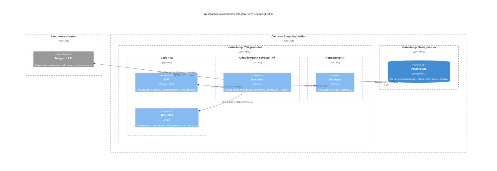

# Диаграмма компонентов
Диаграмма компонентов показывает внутреннюю структуру контейнера, разбивая его на логические компоненты (модули, классы, сервисы) и связи между ними.

Диаграмма отображает внутреннюю структуру системы  на уровне компонентов. Система разделена на два основных контейнера:
1. Контейнер: Telegram-бот
   Содержит логические блоки, каждый из которых отвечает за конкретную часть логики:

    - Обработчики — принимают команды, сообщения и callback-запросы, маршрутизируют их и управляют взаимодействием с пользователем:
         - Handlers: обрабатывает действия пользователя, такие как создание и просмотр списков, удаление, совместный доступ, переходы между меню. Также управляет отправкой сообщений и обновлением интерфейса через клавиатуры.
 
    - Репозитории — осуществляют доступ к данным, хранящимся в базе:
        - DatabaseRepo: реализует операции чтения и записи в базу PostgreSQL, включая добавление, изменение и удаление списков, категорий и         товаров, а также обработку связей между пользователями и списками.

    - Сервисы — вспомогательные компоненты, реализующие бизнес-логику:
       - FSM: отвечает за управление пошаговыми сценариями, позволяя пользователю последовательно вводить данные (например, название списка         или товара).

       - JWT Utils: реализует безопасную генерацию и проверку одноразовых токенов доступа (на основе библиотеки pyjwt) для предоставления            совместного использования списков.
2. Контейнер: База данных
    - PostgreSQL: централизованное хранилище пользовательских данных. Хранит таблицы пользователей, списков покупок, категорий, товаров, связей между пользователями и списками. Структура спроектирована так, чтобы поддерживать как личные, так и совместно используемые списки.

Ключевые взаимодействия:
- Telegram API — для отправки/получения сообщений и callback-запросов.
