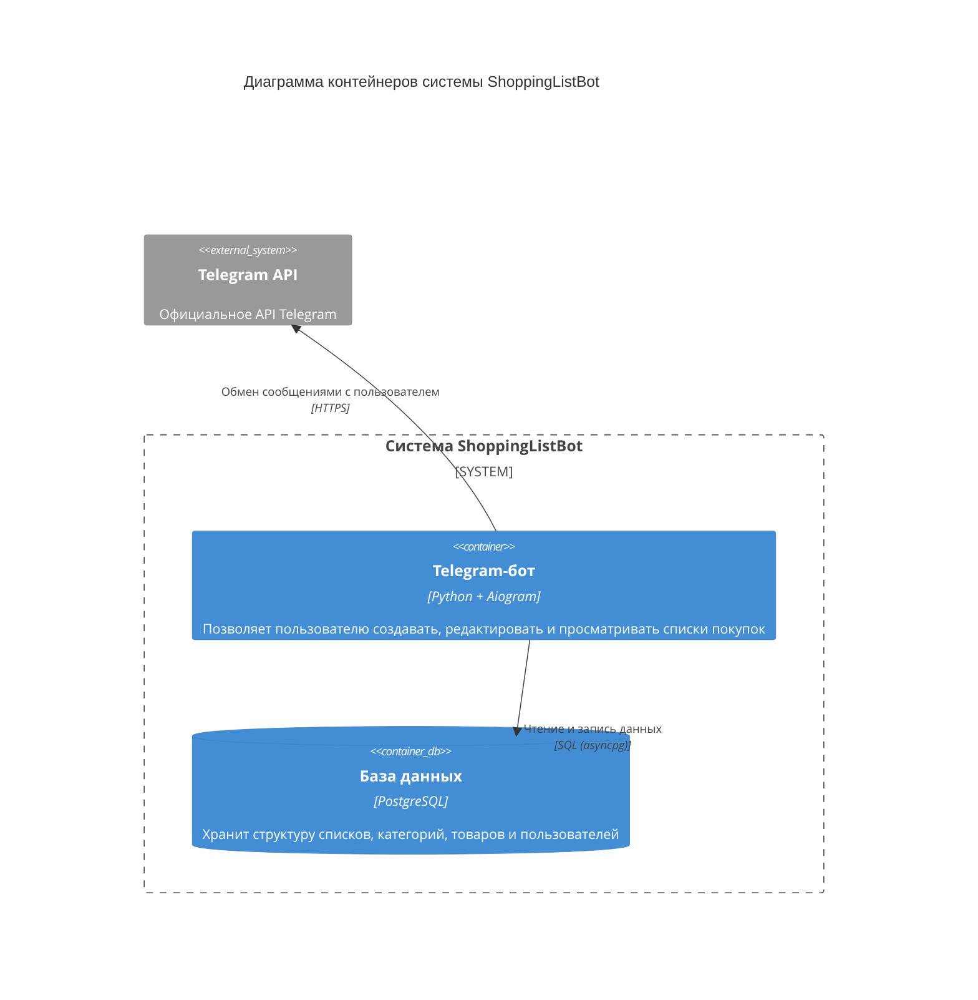

# Диаграмма контейнеров
Диаграмма контейнеров C4 показывает высокоуровневую архитектуру системы, выделяя основные подсистемы внутри границ рассматриваемой системы и их взаимодействие с внешними системами.

## Описание контейнеров:
1. Telegram-bot (Python + aiogram):
- Создание списков, категорий и товаров в них
- Просмотр списков
- Удаление списков, категорий, товаров
- Совместный доступ к спискам через токены
2. База данных(PostgreSQL):
- Хранит данные о пользователях, списках, категориях и товарах.
## Внешние системы:
1. Telegram — платформа для работы бота. Обеспечивает коммуникацию с пользователями.

