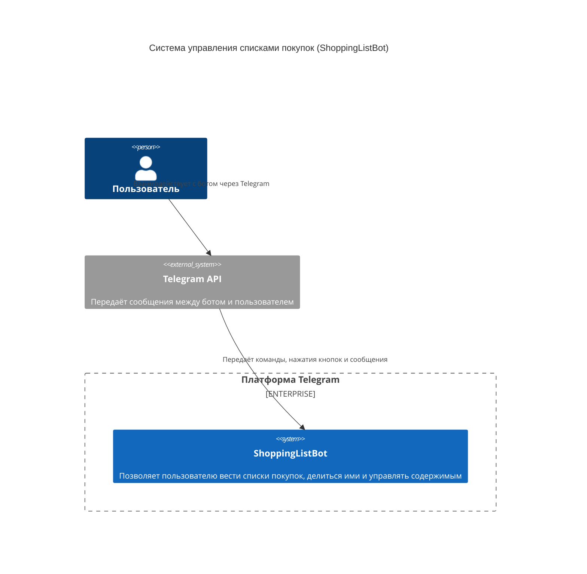

# Диаграмма Контекста
 Диаграмма показывает систему в масштабе ее взаимодействия с пользователями и другими системами.

## Описание компонентов:
1. ShoppingListBot.
Telegram-бот, предназначенный для ведения и структурирования списков покупок. Бот имеет функции добавления категорий в список, а также предоставления совместного доступа через специальный токен.

## Внешние системы:
1. Telegram API. Интерфейс, который связывает пользователя и бота. Обеспечивает отправку и получение сообщений, взаимодействие с кнопками и командами.

## Взаимодействия:
1. Пользователь использует Telegram, чтобы создавать списки, категории и товары, а также удаялять или просматривать их.
2. Бот принимает информацию и сохраняет её.
3. Бот по запросу генерирует JWT-код к выбранному списку, который пользователь передаёт другому человеку, другой человек скидывает этот код боту, и получает доступ к нужному списку.
