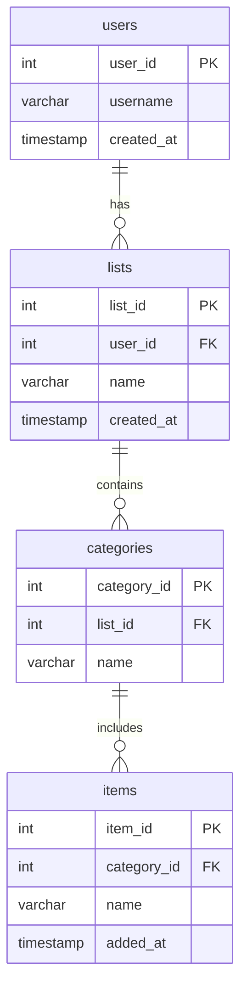

## ER-диаграмма базы данных

```mermaid
erDiagram

    users {
        int user_id PK
        varchar username
        timestamp created_at
    }

    lists {
        int list_id PK
        int user_id FK
        varchar name
        timestamp created_at
    }

    categories {
        int category_id PK
        int list_id FK
        varchar name
    }

    items {
        int item_id PK
        int category_id FK
        varchar name
        timestamp added_at
    }

    users ||--o{ lists : has
    lists ||--o{ categories : contains
    categories ||--o{ items : includes

```
