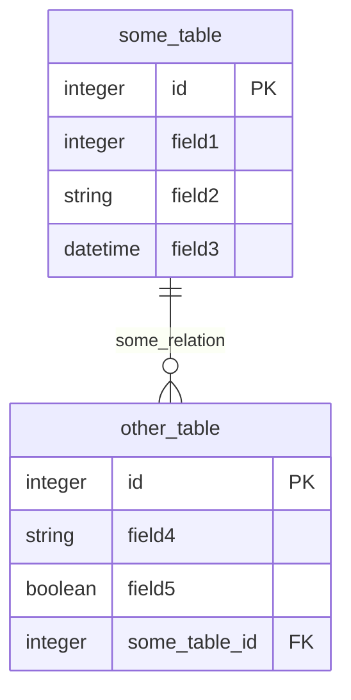

## ER-диаграмма базы данных

```mermaid
erDiagram
    some_table {
        integer id PK
        integer field1
        string field2
        datetime field3
    }
    
    other_table {
        integer id PK
        string field4
        boolean field5
        integer some_table_id FK
    }

    some_table ||--o{ other_table : "some_relation"

```

## Описание диаграммы
Текст описания...